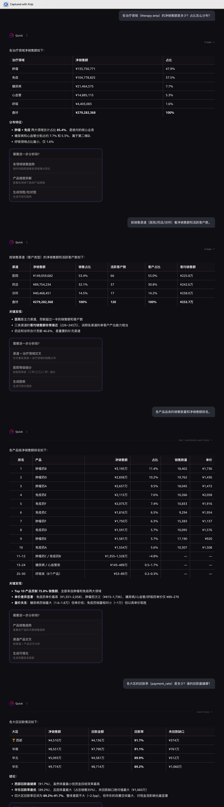
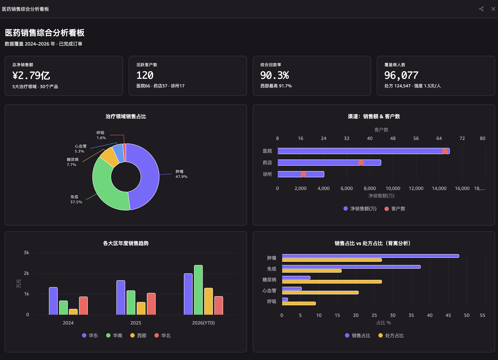

# 医药销售智能数据平台

端到端 POC：在 AWS Redshift Serverless 上落地医药销售数仓、MetricFlow 语义层，
并把语义层暴露成一个**远程 MCP 服务**，让本地 AI agent 用自然语言问数和分析。

## 第一次跑这个项目

看操作文档：**[GETTING-STARTED.md](GETTING-STARTED.md)**

它分两条路径，建议先跑路径 A（不需要 AWS，15 分钟，能验证 90% 的业务逻辑）：

```text
路径 A   本地验证，不连数据库        不需 AWS    15 分钟
路径 B   完整环境，含 Redshift + MCP  需要 AWS    1 小时
```

## 仓库结构

```text
GETTING-STARTED.md     首次运行操作文档
medical-olap-dbt/      医药销售数仓 + MetricFlow 语义层 (dbt)
medical-data-service/  远程 MCP 数据服务：FastAPI + MCP + Vue 前端
infra/                 AWS 部署 Terraform（私有 Redshift + ECS + ALB）
scripts/               运维脚本
```

各子项目文档：

- 数仓与语义层：[medical-olap-dbt/README.md](medical-olap-dbt/README.md)
  - 业务说明：[medical-olap-dbt/docs/business-model.md](medical-olap-dbt/docs/business-model.md)
  - 语义层入门：[medical-olap-dbt/docs/semantic-layer.md](medical-olap-dbt/docs/semantic-layer.md)
- 数据服务（MCP）：[medical-data-service/README.md](medical-data-service/README.md)
- 生产化基建：[infra/README.md](infra/README.md)

> 本文件其余部分是面向客户的项目介绍。

## 1. 项目背景

医药销售业务通常面临以下挑战：

- 销售、客户、产品、营销、回款数据分散在多个业务系统
- 缺少统一口径的指标定义，报表口径不一致
- 营销投入和销售结果难以关联，ROI 难以量化
- 业务人员和 AI 应用都希望用自然语言直接问数，而不必手写 SQL

本 POC 面向以上问题，构建了一个从数据仓库到 MCP 数据服务的完整闭环，验证在 AWS
Redshift Serverless 上落地医药销售数仓、语义层，并让 AI agent 通过 MCP 取数分析的可行性。

## 2. 项目目标

```text
1. 用最小资源搭建 Redshift Serverless 数仓
2. 用 dbt 模拟业务库并构建 DWD / DWS / ADS 分层
3. 覆盖多表关联、跨域分析和营销归因
4. 用 MetricFlow 维护统一语义层
5. 把语义层暴露为远程 MCP 服务
6. 让本地 AI agent 连上 MCP，用自然语言问数与分析
```

## 3. 整体架构

```text
业务模拟数据 (dbt seed)
        ↓
DWD 明细层
        ↓
DWS 汇总层 (含营销归因)
        ↓
ADS 跨域宽表
        ↓
MetricFlow 语义层
        ↓
数据服务 (FastAPI)
        ├── 远程 MCP Server (/mcp, Streamable HTTP)
        │     ├── list_metrics / list_dimensions
        │     ├── preview_sql
        │     └── run_query（生成 SQL + Redshift 执行）
        └── Vue 前端门户（连接指引 / 指标目录 / 查询实验台）
        ↓
本地 AI agent (Amazon Q / Claude ...) —— 自然语言问数
```

两个子项目：

```text
medical-olap-dbt      医药销售数仓 + 语义层
medical-data-service  远程 MCP 数据服务 + Vue 前端
```

## 4. 基础设施

```text
AWS Account: 612674025488
Region: us-east-1
Redshift Serverless Namespace: medical-poc
Workgroup: medical-poc-wg
Database: medical_dw
Base Capacity: 8 RPU
月度用量限制: 100 RPU-hours (超限自动停用)
```

Schema 分层：

```text
sim_business  业务模拟库
dwd           明细层
dws           汇总层
ads           跨域宽表
semantic      语义层对象
```

## 5. 数据仓库设计

### 业务域

```text
客户域   医院 / 药店 / 诊所
产品域   通用名 / 品牌 / 治疗领域
销售域   订单 / 订单明细 / 销售代表 / 区域
营销域   营销活动 / 触点
回款域   回款记录
处方域   处方事件
```

### 分层模型

DWD 明细层：

```text
dim_customer / dim_product / dim_sales_rep
fct_sales_order / fct_sales_order_item
fct_payment / fct_campaign_touchpoint / fct_prescription
```

DWS 汇总层：

```text
sales_daily_summary        销售日汇总
campaign_attribution       营销归因
customer_monthly_summary   客户月度经营
```

ADS 跨域宽表：

```text
ads_sales_attribution_wide
粒度: 订单明细 + 营销触点
```

覆盖场景：

```text
多表关联  订单 - 明细 - 客户 - 产品 - 销售代表
跨域分析  销售 + 营销 + 回款 + 处方
聚合      按区域 / 产品 / 客户 / 时间
归因      linear attribution, 权重和为 1
```

## 6. MetricFlow 语义层

统一维护指标定义，业务和 AI 都通过语义层取数，不直接写 SQL。

核心指标：

```text
net_sales_amount   销售额
payment_amount     回款额
order_count        订单数
attributed_revenue 归因收入
campaign_cost      营销成本
roi                投入产出比
payment_rate       回款率
```

示例：查询各区域销售额，MetricFlow 自动生成 SQL：

```sql
SELECT sales_region_id AS sales_region,
       SUM(net_sales_amount) AS net_sales_amount
FROM dws.sales_daily_summary
GROUP BY sales_region_id
```

## 7. MCP 数据服务

技术栈：

```text
FastAPI + Python
FastMCP（Streamable HTTP 远程 MCP）
MetricFlow Python Engine
Redshift Data API
Vue 3 + shadcn-vue 前端
```

服务把语义层封装成一个远程 MCP，不带任何权限控制（无认证 / 无 RLS / 无 DDM），
定位是纯分析网关。MCP 工具：

```text
list_metrics       列出所有指标及说明
list_dimensions    列出可分组维度及说明
preview_sql        只生成 SQL，不执行
run_query          在 Redshift 上执行并返回列 + 行
```

REST 面（供 Vue 前端用）：

```text
GET  /api/info             服务与 MCP 连接信息
GET  /api/metrics          指标与维度目录
POST /api/query/preview    生成 MetricFlow SQL
POST /api/query            执行查询返回数据
```

## 8. 接入本地 AI agent

远程 MCP 地址：`https://<域名>/mcp`（本地 `http://localhost:8000/mcp`）。

在 Amazon Q / Claude 等客户端的 MCP 配置里加：

```json
{
  "mcpServers": {
    "medical-data-service": {
      "url": "https://<域名>/mcp",
      "transport": "http"
    }
  }
}
```

连上后直接用自然语言问，例如：

> 按大区看今年的净销售额和回款率，分析哪个大区 ROI 最高

agent 会调用 `list_metrics` / `run_query` 等工具，生成 SQL、取数并给出分析。

## 9. 案例展示

### 本地 AI agent 自然语言问数

在 Amazon Q / Claude 里直接用中文提问，agent 自动调用 MCP 工具（`list_metrics` /
`run_query`），把问题翻译成语义层查询、生成 SQL、在 Redshift 取数，并给出分析结论——
全程不用手写 SQL，口径由语义层统一保证。



### Vue 前端门户

服务自带的门户提供连接指引、指标目录和查询实验台：业务人员可以直接浏览可用指标与
维度，在实验台里试跑查询、查看 MetricFlow 生成的 SQL 和返回数据。



## 10. 归因分析

营销归因采用 linear 模型，保证同一订单明细的归因权重之和为 1，可计算：

```text
按活动的归因收入
营销 ROI
触点类型贡献
```

## 11. POC 成本控制

```text
8 RPU 起步
月度用量限制 100 RPU-hours
超限自动停用 Workgroup
数据规模控制在演示级别
```

## 12. 当前验收结果

```text
Redshift Serverless 环境: 就绪
dbt seed / DWD / DWS / ADS: 全部构建并测试通过
MetricFlow 语义层: 指标可查询, SQL 自动生成
远程 MCP: /mcp 可被 agent 连接，工具正常调用
run_query: 生成 SQL 并在 Redshift 执行返回数据
Vue 前端: 连接指引 / 指标目录 / 查询实验台可用
```

## 13. 从本地到 AWS，再到真实生产

三个阶段用的是**同一套业务代码**（dbt 模型、语义层、MCP 服务、前端），
变的只是运行位置和资源规格。

### 本地开发 → AWS 部署

靠环境变量切换：

```text
执行开关    QUERY_EXECUTION_ENABLED=false -> true
Redshift    公网 + IP 白名单             -> 私有子网，只允许服务安全组
服务        本地 uvicorn                 -> ECS Fargate + ALB
前端        本地 Vite                    -> 与 API 同容器，同域名 HTTPS
```

AWS 部署由 [infra/README.md](infra/README.md) 的 Terraform 完成。

### AWS 部署 → 真实生产

架构不变，主要是调规格：

```text
Redshift 容量     base 8 / max 16 RPU  -> base 32-128 / max 256+
ECS 副本          1                    -> 2+，并加 Auto Scaling
可用区            2                    -> 3
用量限制          300 RPU-hours        -> 按预算设
```

真实生产若需要重新引入访问控制（本 POC 已移除），可在 MCP 层加 OAuth 并按组织
架构做行级/列级策略——这不在当前 POC 范围内。
