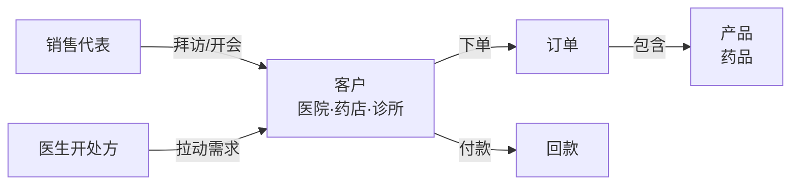
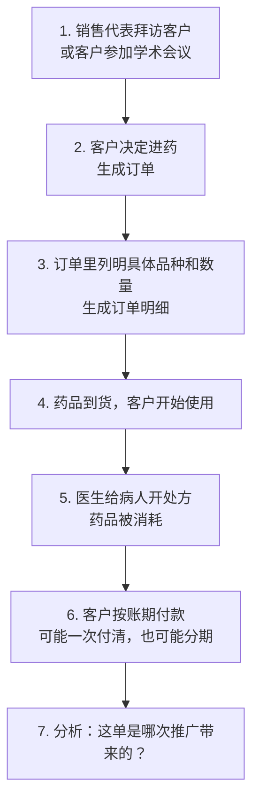
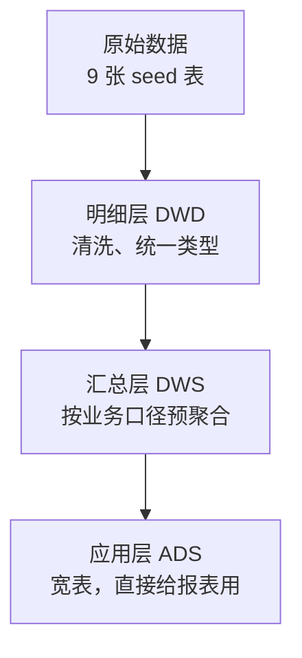

# 业务说明：这些表在讲一个什么故事

这份文档不讲技术，只讲业务。目标是让你看完之后，能对着任意一张表说出「它记录的是公司里哪件事」。

## 目录

1. [一句话概括这个业务](#1-一句话概括这个业务)
2. [参与这门生意的四类角色](#2-参与这门生意的四类角色)
3. [一笔生意从头到尾发生了什么](#3-一笔生意从头到尾发生了什么)
4. [九张原始表分别记录什么](#4-九张原始表分别记录什么)
5. [业务字段的含义和取值](#5-业务字段的含义和取值)
6. [三层数据加工在做什么](#6-三层数据加工在做什么)
7. [业务上真正关心的指标](#7-业务上真正关心的指标)
8. [三个典型业务问题](#8-三个典型业务问题)
9. [数据里预埋的业务故事](#9-数据里预埋的业务故事)
10. [容易误解的几个业务点](#10-容易误解的几个业务点)

---

## 1. 一句话概括这个业务

> 一家药企把药卖给医院、药店和诊所，靠销售代表和学术推广活动去开拓客户，卖完之后还要把钱收回来。

注意这是 **B2B**，不是网上药店：

```text
不是：病人在 App 上买感冒药
而是：药企的销售代表去三甲医院谈进药，医院下单，药企发货，医院分期付款
```

这个区别决定了整套数据的形状。因为是 B2B，才会有销售代表、医院等级、学术会议、账期回款这些概念。

---

## 2. 参与这门生意的四类角色



### 客户：买药的一方

不是个人，是机构。共 120 家，分三类：

| 类型 | 数量 | 业务特点 |
|---|---:|---|
| 医院 | 66 | 单量大、金额高、账期长、需要学术推广 |
| 药店 | 37 | 单量小、以 OTC 为主、付款快 |
| 诊所 | 17 | 介于两者之间 |

### 产品：卖的药

共 30 个品种，按两个角度分类：

```text
按治疗领域（therapy_area）：肿瘤、免疫、糖尿病、心血管、呼吸
按处方属性（product_category）：处方药 26 个、OTC 4 个
```

价格区间是 98 元到 2232 元。**肿瘤和免疫类偏贵，OTC 便宜**，这符合真实医药市场。

### 销售代表：负责卖的人

24 个人，平均分在四个大区，每个大区 6 人。他们的工作是：

```text
拜访客户 → 组织学术会议 → 促成订单 → 跟踪回款
```

代表的业绩考核直接和他名下客户的销售额挂钩，所以数据里 `sales_rep_id` 很重要。

### 医生：不买药，但决定要不要用药

医生本人不出现在客户表里，但他们的处方行为被记录在处方表里。逻辑是：

```text
医生开的处方越多 → 医院的药越快用完 → 医院下一次进货越多
```

所以处方数据是**需求的领先指标**，销售数据是**结果**。

---

## 3. 一笔生意从头到尾发生了什么

按时间顺序走一遍：



每一步都对应一张表：

| 业务动作 | 对应的表 |
|---|---|
| 拜访、开会、发邮件 | `seed_campaign_touchpoints` |
| 客户下单 | `seed_sales_orders` |
| 订单里买了哪些药 | `seed_sales_order_items` |
| 医生开处方 | `seed_prescriptions` |
| 客户付款 | `seed_payments` |
| 客户是谁 | `seed_customers` |
| 药是什么 | `seed_products` |
| 谁负责这个客户 | `seed_sales_reps` |

---

## 4. 九张原始表分别记录什么

### 4.1 `seed_customers` — 客户档案（120 行）

**记录的业务事实**：我们的客户都是谁，在哪，属于哪个大区，由谁负责。

```csv
customer_id,customer_name,customer_type,hospital_level,province_code,city_code,sales_region_id,customer_segment
C0001,华东药店001,药店,,320000,320100,R_EAST,C
```

关键点：

```text
customer_type      是医院、药店还是诊所
hospital_level     医院等级（三甲/三乙/二甲/一级），药店为空
sales_region_id    归属哪个大区，决定了谁能看到这个客户的数据
customer_segment   客户价值分级 A/B/C
```

`hospital_level` 为空是正常的——药店没有等级这个概念。

`customer_segment` 的 A/B/C 是**客户价值分层**，通常按年采购额或战略重要性划分：

```text
A 类  33 家   核心客户，重点投入资源
B 类  49 家   潜力客户
C 类  38 家   长尾客户，维护为主
```

### 4.2 `seed_products` — 产品目录（30 行）

**记录的业务事实**：我们卖哪些药，属于什么治疗领域，标价多少。

```csv
product_id,product_name,generic_name,therapy_area,product_category,list_price
P001,肿瘤药A,通用名1,肿瘤,处方药,1618.35
```

关键点：

```text
generic_name        通用名（化学名），医保和招标看这个
therapy_area        治疗领域，是药企划分事业部的主要方式
product_category    处方药还是 OTC，决定销售渠道和推广方式
list_price          官方标价，实际成交价通常有折扣
```

为什么 `therapy_area` 重要：药企内部通常按治疗领域设事业部（肿瘤事业部、糖尿病事业部），预算、人员、目标都是分开的。所以「肿瘤线今年增长多少」是高频问题。

### 4.3 `seed_sales_reps` — 销售代表（24 行）

**记录的业务事实**：谁在卖，负责哪个大区。

```csv
sales_rep_id,sales_rep_name,sales_region_id
SR001,华东代表1,R_EAST
```

四个大区各 6 人：

```text
R_EAST   华东    上海、江苏
R_SOUTH  华南    广东、福建
R_NORTH  华北    北京、天津
R_WEST   西部    四川、陕西
```

### 4.4 `seed_sales_orders` — 订单主表（3238 行）

**记录的业务事实**：哪个客户、哪天、通过什么渠道、由谁经手，下了一单。

```csv
order_id,customer_id,order_date,order_status,sales_rep_id,channel_id
O000001,C0009,2024-01-26,COMPLETED,SR003,CLINIC
```

这张表**不包含金额**。金额在订单明细里。这是标准做法：

```text
订单主表   记"这一单的整体信息"（谁、什么时候、什么状态）
订单明细   记"这一单具体买了什么"（哪个药、多少盒、多少钱）
```

`order_status` 的业务含义：

```text
COMPLETED  3032 单   已完成，可以计入销售额
CANCELLED   206 单   已取消，不能计入销售额
```

取消率约 6.4%，是正常水平。**所有销售分析都必须先过滤掉 CANCELLED**，否则销售额会虚高。

### 4.5 `seed_sales_order_items` — 订单明细（6456 行）

**记录的业务事实**：每一单里，每个品种买了多少、多少钱。

```csv
order_item_id,order_id,product_id,quantity,unit_price,discount_amount,net_amount
OI0000001,O000001,P004,21,1433.48,826.58,29276.5
```

金额是这么算的：

```text
net_amount = quantity × unit_price - discount_amount
           = 21 × 1433.48 - 826.58
           = 30103.08 - 826.58
           = 29276.50
```

三个金额字段的业务区别：

```text
unit_price        实际成交单价（可能低于 list_price）
discount_amount   额外折让（返利、促销）
net_amount        净额，这才是真正确认的收入
```

平均每单 2 个明细（6456 ÷ 3238），符合 B2B 采购习惯——一次进几个品种。

### 4.6 `seed_payments` — 回款记录（3032 行）

**记录的业务事实**：客户什么时候付了多少钱。

```csv
payment_id,order_id,payment_date,payment_amount,payment_status
PAY000001,O000001,2024-03-06,29276.5,PAID
```

这张表是 B2B 医药最关键的表之一。因为：

```text
下单 ≠ 收到钱
```

医院账期通常 60 到 180 天。所以：

```text
payment_status = PAID     2416 笔   已全额付清
payment_status = PARTIAL   616 笔   只付了一部分
```

大约 20% 的订单存在**部分回款**，这是真实的资金压力。财务最关心的不是销售额，而是：

```text
回款率 = 已回款金额 / 销售额
```

注意这张表的行数（3032）和已完成订单数（3032）恰好相同——本数据集中每个已完成订单对应一条回款记录。

### 4.7 `seed_campaign_touchpoints` — 推广活动接触记录（3177 行）

**记录的业务事实**：什么时候、通过什么方式、花了多少钱接触了哪个客户。

```csv
touchpoint_id,customer_id,campaign_id,touchpoint_time,touchpoint_type,sales_rep_id,cost_amount
T000001,C0009,CAMP006,2024-01-14,HOSPITAL_VISIT,SR003,1754.41
```

四种接触方式，成本和效果差别很大：

| 类型 | 业务含义 | 成本 |
|---|---|---|
| `HOSPITAL_VISIT` | 代表到医院拜访科室主任 | 中 |
| `CONFERENCE` | 组织或赞助学术会议 | 高 |
| `EMAIL` | 学术资料邮件推送 | 低 |
| `ONLINE` | 线上直播、webinar | 低到中 |

共 15 个推广活动（`CAMP001` 到 `CAMP015`）。

这张表存在的意义是回答市场部的核心问题：

```text
我花的推广费，带来了多少销售额？
```

### 4.8 `seed_prescriptions` — 处方事件（1978 行）

**记录的业务事实**：某个客户那里，某个药被开了多少次，覆盖多少病人。

```csv
prescription_event_id,customer_id,product_id,event_date,prescription_count,patient_count
RX000001,C0007,P002,2024-01-02,79,64
```

两个数字的区别：

```text
prescription_count  开了多少张处方（一个病人可能反复开）
patient_count       覆盖了多少个不同病人
```

例子里 79 张处方覆盖 64 个病人，说明有些病人复诊续方。

业务价值：这是**真实用药需求**的证据。销售额可能因为压货虚高，但处方量骗不了人：

```text
处方量上升 → 真实需求增长 → 销售可持续
处方量平稳但进货猛增 → 客户在压货 → 未来可能退货或减单
```

### 4.9 `seed_date_spine` — 日期表（1096 行）

**记录的业务事实**：从 2024-01-01 到 2026-12-31 每一天。

它不记录业务事件，作用是保证时间序列完整。比如某个月一单都没有，报表里也要显示这个月，值为 0，而不是整行消失。

---

## 5. 业务字段的含义和取值

### 5.1 大区和省份的对应关系

```text
R_EAST   华东   上海(310000)  江苏(320000)
R_SOUTH  华南   广东(440000)  福建(350000)
R_NORTH  华北   北京(110000)  天津(120000)
R_WEST   西部   四川(510000)  陕西(610000)
```

大区是**权限边界**。华东大区经理只能看华东数据，这在系统里是通过行级权限实现的。

### 5.2 销售渠道

```text
HOSPITAL   医院渠道，走招标和集采
PHARMACY   药店渠道，走商业公司配送
CLINIC     诊所渠道，量小但分散
```

同一个客户可能通过不同渠道下单，所以渠道记在订单上，不是记在客户上。

### 5.3 医院等级

```text
三甲   最高级，教学医院，进药门槛高但量大
三乙   次之
二甲   地市级
一级   基层
```

等级越高，学术推广越重要，账期通常也越长。

---

## 6. 三层数据加工在做什么

原始数据不能直接给业务用，中间要加工。这里分三层：



### 6.1 明细层（DWD）：把原始数据洗干净

做的事情很朴素：

```text
把文本日期转成真正的日期类型
把文本金额转成小数类型
加上 etl_loaded_at 记录什么时候加载的
```

它**不改变业务含义**，一行进一行出。8 张表：

```text
dim_customer            客户维度
dim_product             产品维度
dim_sales_rep           销售代表维度
fct_sales_order         订单事实
fct_sales_order_item    订单明细事实
fct_payment             回款事实
fct_campaign_touchpoint 推广接触事实
fct_prescription        处方事实
```

`dim_` 开头是**维度表**（描述"是什么"），`fct_` 开头是**事实表**（记录"发生了什么"）。

### 6.2 汇总层（DWS）：按业务口径算好

三张汇总表，各回答一类问题：

#### `sales_daily_summary` — 每天卖了多少

```text
粒度：日期 + 客户 + 产品 + 大区 + 代表 + 渠道
内容：订单数、数量、销售额、回款额
```

已经做了两件业务决策：

```text
1. 只算 COMPLETED 的订单（排除取消单）
2. 只算 PAID 和 PARTIAL 的回款（排除失败的）
```

这样业务人员不用每次都记得加过滤条件。

#### `campaign_attribution` — 这单是哪次推广带来的

这是最需要解释的一张表。它回答：

```text
客户下单前接触过哪些推广活动？这笔收入该记给谁？
```

规则是：

```text
同一个客户
且推广活动发生在下单前 90 天内 → 建立关联
```

那个 90 天叫**回溯窗口**。没有它的话，两年前发的一封邮件也会被算作今天这笔订单的功劳，
那是说不通的。窗口长度可以调（`dbt_project.yml` 里的 `attribution_lookback_days`）。

有约 6% 的订单明细在窗口内没有任何推广接触，这部分算**自然成交**，不计入营销功劳。

如果一单明细接触过 3 次推广，就把收入平均分成 3 份：

```text
订单明细金额 1000 元，关联 3 次推广
每次推广记 333.33 元
三次加起来还是 1000 元
```

这叫**线性归因**。为什么要平均分而不是全算给某一次：

```text
如果每次都算 1000 元，汇总后变成 3000 元
公司实际只收了 1000 元，报表就骗人了
```

#### `customer_monthly_summary` — 每个客户每月的活跃度

```text
粒度：月份 + 客户
内容：接触次数、订单数、销售金额
```

用来看客户健康度：接触很多但不下单的客户需要换策略。

### 6.3 应用层（ADS）：一张宽表搞定报表

`ads_sales_attribution_wide` 把所有维度拼在一起，让报表不用再 JOIN：

```text
订单信息 + 客户信息 + 产品信息 + 代表信息 + 推广信息 + 金额 + 回款
```

还额外加了三个权限控制字段：

```text
data_region_code   这行数据属于哪个大区（控制谁能看）
data_owner_id      这行数据属于哪个代表（控制谁能看）
sensitive_level    敏感级别（控制哪些列要打码）
```

比如华东大区经理查这张表，只能看到 `data_region_code = 'R_EAST'` 的行，客户名称可能显示为 `****`。

---

## 7. 业务上真正关心的指标

### 7.1 销售相关

| 指标 | 业务含义 | 谁最关心 |
|---|---|---|
| 净销售额 | 扣折让后确认的收入 | 全公司 |
| 订单数 | 成交笔数 | 销售部 |
| 销售数量 | 卖了多少盒/支 | 生产、供应链 |

### 7.2 财务相关

| 指标 | 业务含义 | 谁最关心 |
|---|---|---|
| 回款金额 | 实际收到的钱 | 财务部 |
| 回款率 | 回款 ÷ 销售额 | 财务、CFO |

回款率是 B2B 医药的生命线。销售额再高，收不回钱就是纸面利润。

### 7.3 市场相关

| 指标 | 业务含义 | 谁最关心 |
|---|---|---|
| 归因收入 | 某次推广带来的销售额 | 市场部 |
| 推广成本 | 花在推广上的钱 | 市场部 |
| ROI | 归因收入 ÷ 推广成本 | 市场部、CEO |

ROI 决定明年的市场预算怎么分。

### 7.4 医学相关

| 指标 | 业务含义 | 谁最关心 |
|---|---|---|
| 处方量 | 医生开了多少张处方 | 医学部 |
| 覆盖病人数 | 触达了多少病人 | 医学部 |

这两个指标反映真实临床使用，是判断销售数据健康度的参照。

---

## 8. 三个典型业务问题

### 8.1 各大区三年趋势如何

```text
问的是：哪个大区在增长，哪个在掉队
用到的表：sales_daily_summary
分组：月份 + 大区
指标：净销售额
```

管理层用这个决定资源往哪个大区倾斜。

### 8.2 哪个治疗领域的活跃客户在增长

```text
问的是：肿瘤线的客户数是在扩大还是萎缩
用到的表：sales_daily_summary + dim_product
分组：年份 + 治疗领域
指标：有采购的客户数
```

事业部负责人用这个判断自己的市场是否在扩张。注意「活跃客户数」比「销售额」更能反映真实覆盖——销售额可能靠几个大客户撑着。

### 8.3 各治疗领域销售占比怎么变

```text
问的是：公司的产品结构在往哪个方向漂移
用到的表：sales_daily_summary + dim_product
分组：年份 + 治疗领域
指标：该领域销售额 ÷ 总销售额
```

占比变化比绝对值更能说明战略执行情况。

---

## 9. 数据里预埋的业务故事

这份测试数据不是随机生成的，它讲了一个有情节的故事：

### 9.1 四个大区走出四条不同的曲线

```text
华东   稳步增长，成熟市场，基本盘
华南   强劲增长，2026 年反超华东成为第一
华北   增长缓慢，明显滞涨，需要干预
西部   基数低但增速快，潜力市场
```

这样设计是为了让「区域趋势分析」有真实的结论可讲，而不是四条平行线。

### 9.2 产品结构在漂移

```text
肿瘤、免疫   活跃客户明显增长
免疫         销售占比持续上升
糖尿病、心血管、呼吸   销售占比下降
```

这模拟了真实药企的转型：从传统慢病药向创新生物药倾斜。

### 9.3 时间跨度覆盖三年

```text
2024-01-01 到 2026-12-31
1096 天
```

三年才能算出有意义的同比、环比和复合增长率。

---

## 10. 容易误解的几个业务点

### 10.1 订单数不等于订单明细数

```text
订单        3238 单
订单明细    6456 行
```

一单可以买多个品种。**统计"卖了多少单"要数订单，统计"卖了多少品种次"才数明细**。

### 10.2 销售额不等于收到的钱

```text
销售额   订单确认的金额
回款额   客户实际付的钱
```

两者之间是账期。20% 的订单只付了部分款。**不要用销售额去汇报现金流**。

### 10.3 取消的订单不算业绩

```text
3238 单里有 206 单是 CANCELLED
```

所有销售口径都要先过滤。忘记过滤会让销售额虚高约 6%。

### 10.4 推广成本不能直接相加

归因表里，同一次推广活动如果影响了多个订单明细，它的成本会出现多次：

```text
推广活动 TP001 实际花了 100 元
它影响了 2 条订单明细
归因表里就有 2 行，每行都写 100 元
直接相加 = 200 元   ← 错的
```

**算推广总成本要去重，不能在归因表里直接求和**。

### 10.5 处方量和销售额可能背离

```text
销售额涨、处方量不涨   → 客户在压货，未来有风险
销售额平、处方量涨     → 真实需求在起来，可以加大投入
```

这两个指标要一起看。只看销售额容易被短期压货掩盖真相。

### 10.6 药店没有医院等级

```text
医院   66 家   有等级（三甲/三乙/二甲/一级）
诊所   17 家   有等级
药店   37 家   等级为空
```

`hospital_level` 是空值不是数据缺失，是业务上本来就不适用。做报表时不要把空值当异常处理。

---

## 一页速记

```text
业务：药企卖药给医院/药店/诊所（B2B）

主线：推广接触 → 客户下单 → 明细列品种 → 医生开处方 → 客户回款

九张原始表
  客户 · 产品 · 销售代表           谁参与
  订单 · 订单明细                  卖了什么
  回款                             收到多少钱
  推广接触                         花了多少钱去推
  处方事件                         真实用了多少
  日期表                           保证时间连续

三层加工
  DWD   洗干净，不改口径
  DWS   按业务规则预聚合
  ADS   拼成宽表，带权限字段

四个核心指标
  净销售额     卖了多少
  回款率       收回来多少
  ROI          推广值不值
  处方量       真实需求如何

四条必守规则
  1. 排除 CANCELLED 订单
  2. 销售额 ≠ 回款额
  3. 订单数 ≠ 明细数
  4. 推广成本要去重
```
