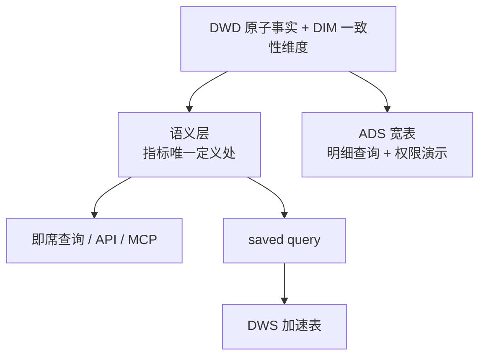

# 语义层入门：读懂 `models/dwd/schema.yml`

这份文档讲本项目的语义层配置，按从零开始的顺序展开。主文件是：

```text
medical-olap-dbt/models/dwd/schema.yml
```

配套文件：

```text
medical-olap-dbt/models/semantic/cross_model_metrics.yml   跨模型比率指标
medical-olap-dbt/models/semantic/saved_queries.yml         常用查询登记
medical-olap-dbt/models/semantic/time_spine.yml            时间骨架
```

## 目录

1. [语义层解决什么问题](#1-语义层解决什么问题)
2. [第一个最小例子](#2-第一个最小例子)
3. [加上时间](#3-加上时间)
4. [加上维度](#4-加上维度)
5. [跨表维度：Entity 的作用](#5-跨表维度entity-的作用)
6. [`primary` 和 `foreign` 怎么选](#6-primary-和-foreign-怎么选)
7. [`primary_entity` 是另一回事](#7-primary_entity-是另一回事)
8. [为什么语义层建在 DWD 而不是 DWS](#8-为什么语义层建在-dwd-而不是-dws)
9. [指标定义在哪张表：粒度决定一切](#9-指标定义在哪张表粒度决定一切)
10. [把过滤条件写进指标](#10-把过滤条件写进指标)
11. [比率指标：不可加，必须分别聚合](#11-比率指标不可加必须分别聚合)
12. [归因桥接表为什么特殊](#12-归因桥接表为什么特殊)
13. [saved query 与派生缓存](#13-saved-query-与派生缓存)
14. [语义层和权限的关系](#14-语义层和权限的关系)
15. [常见错误](#15-常见错误)
16. [动手验证](#16-动手验证)
17. [一页速查表](#17-一页速查表)

---

## 1. 语义层解决什么问题

### 1.1 没有语义层的时候

业务问「2025 年每月各区域净销售额」，你写：

```sql
SELECT
    DATE_TRUNC('month', o.order_date) AS month,
    c.sales_region_id,
    SUM(oi.net_amount) AS net_sales_amount
FROM dwd.fct_sales_order o
JOIN dwd.fct_sales_order_item oi ON oi.order_id = o.order_id
JOIN dwd.dim_customer c ON c.customer_id = o.customer_id
WHERE o.order_status = 'COMPLETED'
GROUP BY 1, 2;
```

换成按客户类型，又要重写一次。问题在于：

```text
每换一个分组维度就重写 SQL
JOIN 关系要自己记
CANCELLED 过滤容易忘（忘了销售额虚高约 6%）
不同人写出的"净销售额"可能不一致
```

### 1.2 有语义层之后

声明一次，之后只描述意图：

```text
我要 net_sales_amount，按月份和大区分组
```

SQL 由 MetricFlow 生成，JOIN、聚合、过滤条件全部自动带上。

### 1.3 所以 `schema.yml` 是什么

```text
models/dwd/*.sql       负责"数据怎么算出来、存到哪张表"
models/dwd/schema.yml  负责"这些表怎么被业务理解和查询"
```

关键点：`schema.yml` **不会创建任何列**，它只描述已经存在的列。

---

## 2. 第一个最小例子

假设表 `dwd.fct_sales_order_item` 长这样：

```text
order_item_id  order_id  order_date   customer_id  net_amount
-------------  --------  -----------  -----------  ----------
OI001          O001      2025-01-01   C001              1000
OI002          O001      2025-01-01   C001               500
OI003          O002      2025-01-02   C002              2000
```

最小的语义层配置：

```yaml
version: 2

models:
  - name: fct_sales_order_item
    semantic_model:
      enabled: true
      name: sales_order_items

    metrics:
      - name: net_sales_amount
        type: simple
        agg: sum
        expr: net_amount
```

### 2.1 逐行理解

```yaml
models:
  - name: fct_sales_order_item
```

指向已存在的 dbt 模型。

```yaml
    semantic_model:
      enabled: true
      name: sales_order_items
```

注册为语义模型。`name` 是语义模型名，可以和 dbt 模型名不同。

```yaml
      - name: net_sales_amount     # 指标名，查询时用
        type: simple               # 直接对一列聚合
        agg: sum                   # 聚合方式
        expr: net_amount           # 物理列名
```

### 2.2 `name` 和 `expr` 的区别

本项目里有一个真实例子：

```yaml
- name: campaign_cost      # 业务叫"推广成本"
  expr: cost_amount        # 表里的列叫 cost_amount
```

生成的 SQL：

```sql
SUM(cost_amount) AS campaign_cost
```

所以：

```text
name  业务想怎么称呼这个指标
expr  数据库里真实的列名或表达式
```

---

## 3. 加上时间

大多数业务问题带时间，所以语义模型要知道哪一列代表时间。

```yaml
models:
  - name: fct_sales_order_item
    semantic_model:
      enabled: true
      name: sales_order_items

    agg_time_dimension: order_date       # 模型级：默认时间列

    columns:
      - name: order_date
        granularity: day                 # 列级：最小粒度是天
        dimension:
          type: time
          name: order_date
```

查询按月：

```text
metrics:  net_sales_amount
group by: metric_time__month
```

生成：

```sql
SELECT
  DATE_TRUNC('month', order_date) AS metric_time__month,
  SUM(net_amount) AS net_sales_amount
FROM "medical_dw"."dwd"."fct_sales_order_item"
GROUP BY DATE_TRUNC('month', order_date)
```

`metric_time` 是 MetricFlow 的统一时间概念，会映射到 `agg_time_dimension` 指定的列。

---

## 4. 加上维度

```yaml
    columns:
      - name: order_status
        dimension:
          type: categorical
          name: order_status
```

`categorical` 表示离散值，用于分组和过滤。

### 一条硬规则

只能声明**表里真实存在的列**。如果声明了不存在的列：

```text
dbt parse            通过（它不检查列是否存在）
按这个维度查询       生成的 SQL 引用该列
Redshift 执行        报错 column does not exist
```

---

## 5. 跨表维度：Entity 的作用

### 5.1 问题

业务想按客户类型看销售额，但两个字段在不同表：

```text
dwd.fct_sales_order_item   customer_id, net_amount      有金额，没客户类型
dwd.dim_customer           customer_id, customer_type   有客户类型，没金额
```

### 5.2 一个常见误解

有人以为 dbt 里存在依赖关系，MetricFlow 就能自动推断出 `customer_type`。

**它不会。** MetricFlow 不读 dbt 的模型依赖图来猜维度归属，必须显式声明。

### 5.3 解决办法：两边用同一个 entity 名

事实表声明外键：

```yaml
  - name: fct_sales_order_item
    columns:
      - name: customer_id
        entity:
          type: foreign          # 外键
          name: customer         # 实体名
```

维表声明主键：

```yaml
  - name: dim_customer
    semantic_model:
      enabled: true
      name: customers
    columns:
      - name: customer_id
        entity:
          type: primary          # 主键
          name: customer         # 实体名相同 ← 关键
      - name: customer_type
        dimension:
          type: categorical
          name: customer_type
```

关键在于：

```text
fct_sales_order_item.customer_id  →  entity: customer  (foreign)
dim_customer.customer_id          →  entity: customer  (primary)
                                            ↑
                                    名字相同才能连
```

### 5.4 查询时用双下划线

```text
customer__customer_type
    │            │
    │            └── 该实体下的维度名
    └── 实体名
```

生成的 SQL：

```sql
SELECT
  customers_src.customer_type AS customer__customer_type,
  SUM(sales_order_items_src.net_amount) AS net_sales_amount
FROM "medical_dw"."dwd"."fct_sales_order_item" sales_order_items_src
LEFT OUTER JOIN "medical_dw"."dwd"."dim_customer" customers_src
  ON sales_order_items_src.customer_id = customers_src.customer_id
GROUP BY customers_src.customer_type
```

### 5.5 Entity 和 Dimension 的分工

```text
Entity（实体）
  作用：连接两张表
  例子：customer_id、product_id
  用途：给 MetricFlow 找 JOIN 路径，不是给业务分组用的

Dimension（维度）
  作用：分组和过滤
  例子：customer_type、therapy_area、hospital_level
  用途：业务真正想看的切分角度
```

一句话：

```text
customer_id    是"怎么连"
customer_type  是"想看什么"
```

### 5.6 为什么事实表要带齐外键

MetricFlow 支持最多两跳的多跳 JOIN，但需要额外的 entity path 语法，容易出错。

本项目的做法是让每张事实表**带齐自己的全部外键**，让所有维度都一跳可达：

```sql
-- fct_sales_order_item.sql
select
    oi.order_item_id,
    oi.order_id,
    o.order_date,
    o.order_status,
    o.customer_id,      -- 来自订单头
    oi.product_id,
    o.sales_rep_id,     -- 来自订单头
    o.channel_id,       -- 来自订单头
    c.sales_region_id,  -- 来自客户维表
    ...
from {{ ref('seed_sales_order_items') }} oi
join {{ ref('fct_sales_order') }} o on o.order_id = oi.order_id
join {{ ref('dim_customer') }} c on c.customer_id = o.customer_id
```

这不是「过度反范式」，而是标准维度建模：**明细粒度的事实表持有全部维度外键**，`order_id` 和 `order_status` 作为退化维度留在行上。

---

## 6. `primary` 和 `foreign` 怎么选

### 6.1 判断标准只有一个

```text
这个字段在【当前这张表】里是否每行唯一？

唯一     → type: primary
不唯一   → type: foreign
```

### 6.2 `primary` 的例子

`dim_customer` 里每行一个客户：

```yaml
  - name: dim_customer
    columns:
      - name: customer_id
        entity:
          type: primary
          name: customer
        tests: [not_null, unique]      # 用测试守住这个前提
```

`tests: [unique]` 很重要：语义层假设它唯一，测试才能保证它真的唯一。

### 6.3 `foreign` 的例子

`fct_sales_order_item` 是明细表，同一客户会出现多次：

```text
order_item_id  customer_id
-------------  -----------
OI001          C001
OI002          C001        ← 重复
OI003          C001        ← 又重复
```

所以只能是：

```yaml
      - name: customer_id
        entity:
          type: foreign
          name: customer
```

### 6.4 常见错误：看到 `_id` 就写 primary

判断依据是**数据是否唯一**，不是字段名。如果把明细表的 `customer_id` 写成 `primary`，MetricFlow 会以为这张表是客户维表，可能生成错误的 JOIN。

---

## 7. `primary_entity` 是另一回事

### 7.1 和上一章的区别

名字很像，层级和作用完全不同：

```text
columns[].entity.type: primary
  位置：列级
  含义：这个物理字段在本表唯一
  影响：MetricFlow 用它做 JOIN

primary_entity
  位置：模型级
  含义：给这个模型的逻辑粒度起个名字
  影响：不参与 JOIN，只是语义元数据
```

### 7.2 为什么需要它

MetricFlow 要求每个维度都能归属到某个实体，以保证维度名唯一。本项目的事实表没有单一唯一列可以充当主实体，所以给逻辑粒度起名：

```yaml
  - name: fct_sales_order_item
    primary_entity: order_item

  - name: fct_payment
    primary_entity: payment
```

### 7.3 它带来的一个实际好处

正因为有 `primary_entity`，同名维度可以在不同模型里共存。本项目里 `order_status` 同时出现在两张表：

```text
fct_sales_order_item   primary_entity: order_item   →  order_item__order_status
fct_payment            primary_entity: payment      →  payment__order_status
```

两者是不同的 `(primary_entity, dimension)` 组合，所以不冲突，而且过滤时不会指错表。

### 7.4 它不是什么

```text
不是数据库的 PRIMARY KEY 约束
不是物理表里的某一列
不会出现在生成的 JOIN SQL 里
```

---

## 8. 为什么语义层建在 DWD 而不是 DWS

这是本项目最重要的一个架构决定。

### 8.1 结论

```text
语义层建在 DWD（原子事实层）+ DIM（一致性维度层）
不建在 DWS（轻度汇总）或 ADS（应用层）上
```

MetricFlow 的工作方式是：拿最细粒度的事实表，按声明的维度和时间粒度**现场聚合**。它需要的是「原子粒度 + 干净 + 有实体和维度可声明」的输入，这正是 DWD + DIM 的定位。

### 8.2 建在 DWS 上会出三类问题

| 问题 | 说明 |
|---|---|
| 粒度丢失 | DWS 按天按产品预汇总后，无法再下钻到订单 |
| 不可加指标算错 | `count_distinct` 和 `ratio` 无法从预汇总表重新推导 |
| 两个真相源 | DWS 已有一套口径，语义层再定义一套，回到「三份 SQL 三个答案」 |

### 8.3 这不是理论，本项目真的错过

重构前语义层建在 `dws.sales_daily_summary` 上，实测结果：

| 指标 | 修正前 | 修正后 | 放大倍数 |
|---|---:|---:|---:|
| `order_count` | 6,029 | **3,032** | 1.99x |
| `payment_amount` | 587,541,651 | **252,213,635** | 2.33x |
| `campaign_cost` | 166,056,404 | **5,105,882** | 32.5x |
| `payment_rate` | 210.38% | **90.31%** | — |
| `average_order_value` | 46,323 | **92,112** | — |

回款率 210% 这种数字，光看就知道口径坏了。

原因很具体。`sales_daily_summary` 按 6 个字段预汇总，一张订单跨 2 个产品就落进 2 个分组，每组 `order_count = 1`：

```text
真实订单数    COUNT(DISTINCT order_id)    3,032
预汇总表      SUM(order_count)            6,029
```

而且这个错**无法从 DWS 修回来**，因为 `order_id` 已经被 sum 掉了。

可以自己复现：

```bash
.venv/bin/python scripts/check_dws_grain_loss.py
.venv/bin/python scripts/check_payment_fanout.py
.venv/bin/python scripts/check_ads_fanout.py
```

### 8.4 那 DWS 和 ADS 去哪了

它们降级为**由真相派生的缓存**：



一句话：

```text
DWD/DIM 是"真相"
DWS/ADS 是"由真相派生的缓存"，不是各自独立的定义源
```

---

## 9. 指标定义在哪张表：粒度决定一切

规则是：**每个指标定义在它自己的原生粒度上**。

本项目的指标归属：

| 语义模型 | 底表 | 粒度 | 指标 |
|---|---|---|---|
| `sales_order_items` | `fct_sales_order_item` | 订单明细 | 净销售额、数量、订单数、明细数、活跃客户数 |
| `payments` | `fct_payment` | 回款记录 | 回款金额 |
| `touchpoints` | `fct_campaign_touchpoint` | 营销活动 | 推广成本、接触次数 |
| `prescriptions` | `fct_prescription` | 处方事件 | 处方量、覆盖病人数 |
| `campaign_attribution` | `fct_campaign_attribution` | 明细 × 活动 | 归因收入、归因权重 |

### 9.1 为什么回款金额不能定义在销售表上

回款是**订单级**的。如果把它放在订单明细表上：

```text
一张订单 2 个明细
回款 1000 元被复制到 2 行
SUM = 2000 元
```

这就是之前 2.33 倍的来源。定义在 `fct_payment` 上，它就在自己的粒度上聚合，不会被复制。

### 9.2 为什么订单数要用 `count_distinct`

```yaml
      - name: order_count
        type: simple
        agg: count_distinct        # 不是 sum，也不是 count
        expr: order_id
```

因为一张订单跨多个明细行：

```text
COUNT(order_id)           = 6,029   行数，错
SUM(order_count)          = 6,029   预汇总遗留，错
COUNT(DISTINCT order_id)  = 3,032   正确
```

生成的 SQL：

```sql
COUNT(DISTINCT order_count) AS order_count
```

（MetricFlow 会把 `expr` 指定的列重命名成指标名，所以内层看到的是 `order_id AS order_count`。）

### 9.3 为什么推广成本不能定义在归因表上

归因表是明细 × 活动粒度，同一个活动会关联多条订单明细：

```text
活动 TP001 实际成本 100 元，关联 2 条明细
归因表里出现 2 行，每行 100 元
SUM = 200 元   ← 错
```

实测放大 32.5 倍。定义在 `fct_campaign_touchpoint` 上就正确了：

```yaml
  - name: fct_campaign_touchpoint
    metrics:
      - name: campaign_cost
        type: simple
        agg: sum
        expr: cost_amount        # 活动粒度，每个活动只有一行
```

---

## 10. 把过滤条件写进指标

业务口径里「销售额」永远不含取消的订单。这个条件应该属于指标定义，而不是靠调用方每次记得加。

```yaml
      - name: net_sales_amount
        type: simple
        agg: sum
        expr: net_amount
        filter: "{{ Dimension('order_item__order_status') }} = 'COMPLETED'"
```

生成的 SQL 自动带上：

```sql
FROM (
  SELECT
    DATE_TRUNC('month', order_date) AS metric_time__month,
    order_status AS order_item__order_status,
    net_amount AS net_sales_amount
  FROM "medical_dw"."dwd"."fct_sales_order_item"
) subq_2
WHERE order_item__order_status = 'COMPLETED'
```

注意 filter 里的前缀：

```text
{{ Dimension('order_item__order_status') }}
                │            │
                │            └── 维度名
                └── primary_entity
```

这就是第 7 章 `primary_entity` 的实际用途——它让过滤条件明确指向哪张表的 `order_status`。

忘记这个过滤的代价：本项目 3,238 单里有 206 单是 CANCELLED，销售额会虚高约 6%。

---

## 11. 比率指标：不可加，必须分别聚合

### 11.1 跨模型的比率写在顶层

分子分母来自不同语义模型时，指标写在顶层 `metrics:`（`models/semantic/cross_model_metrics.yml`）：

```yaml
metrics:
  - name: payment_rate
    label: 回款率
    type: ratio
    numerator: payment_amount        # 来自 payments
    denominator: net_sales_amount    # 来自 sales_order_items

  - name: roi
    label: 营销 ROI
    type: ratio
    numerator: attributed_revenue    # 来自 campaign_attribution
    denominator: campaign_cost       # 来自 touchpoints

  - name: average_order_value
    label: 平均订单金额
    type: ratio
    numerator: net_sales_amount
    denominator: order_count
```

### 11.2 生成的 SQL：先各自聚合，再相除

```sql
SELECT
  metric_time__year,
  CAST(payment_amount AS DOUBLE PRECISION)
    / CAST(NULLIF(net_sales_amount, 0) AS DOUBLE PRECISION) AS payment_rate
FROM (
  SELECT
    COALESCE(subq_6.metric_time__year, subq_13.metric_time__year) AS metric_time__year,
    MAX(subq_6.payment_amount) AS payment_amount,
    MAX(subq_13.net_sales_amount) AS net_sales_amount
  FROM (
    SELECT metric_time__year, SUM(payment_amount) AS payment_amount
    FROM "medical_dw"."dwd"."fct_payment" ...
  ) subq_6
  FULL OUTER JOIN (
    SELECT metric_time__year, SUM(net_sales_amount) AS net_sales_amount
    FROM "medical_dw"."dwd"."fct_sales_order_item" ...
  ) subq_13
  ON subq_6.metric_time__year = subq_13.metric_time__year
) subq_14
```

注意计算顺序：

```text
分子在 fct_payment 上 SUM
分母在 fct_sales_order_item 上 SUM
按共同维度 FULL OUTER JOIN
最后才相除
```

这就是「ratio 不可加」的含义——不能把各行的比率加起来或平均。

### 11.3 一个容易出错的理解

```text
正确（当前定义）：SUM(a) / SUM(b)
错误理解：        AVG(a / b)
```

举例：

```text
行1: 回款 1,    销售 10      → 10%
行2: 回款 900,  销售 1000    → 90%

整体回款率   901 / 1010 = 89.2%    ← 业务要的
明细比例均值 (10%+90%)/2 = 50%     ← 错的
```

### 11.4 `NULLIF` 的作用

```sql
NULLIF(net_sales_amount, 0)
```

分母为 0 时转成 NULL，避免除零报错。结果是 NULL 而不是崩溃。

---

## 12. 归因桥接表为什么特殊

### 12.1 它是桥接表，不是预汇总

`fct_campaign_attribution` 的业务唯一键是：

```text
(order_item_id, touchpoint_id)
```

简单例子：订单明细 `ITEM001` 在下单前接触过两个营销活动：

| order_item_id | touchpoint_id |
|---|---|
| ITEM001 | TP001 |
| ITEM001 | TP002 |

`ITEM001` 出现两次是正常的。这是联合键：相同的 `order_item_id` 可以出现多次，但 `order_item_id + touchpoint_id` 这一对不能重复。

因为它是原子粒度的桥接关系（不是聚合结果），所以它属于 DWD，语义层可以建在上面。

### 12.2 收入为什么要分摊

一条订单明细金额 1000 元，关联 3 个活动，就平均分：

```text
attribution_weight = 1 / 3
attributed_revenue = 1000 / 3 ≈ 333.33
```

三行加起来仍是 1000 元。如果每行都记 1000，按活动汇总会变成 3000 元，虚增两倍。

SQL 实现：

```sql
count(*) over (partition by s.order_item_id) as touchpoint_count

1.0 / touchpoint_count        as attribution_weight
net_amount / touchpoint_count as attributed_revenue
```

### 12.3 只暴露已分摊的字段

```yaml
  - name: fct_campaign_attribution
    metrics:
      - name: attributed_revenue     # 已分摊，加总守恒
      - name: attribution_weight     # 已分摊
      # 没有 campaign_cost，它属于 fct_campaign_touchpoint
      # 没有 net_sales_amount，它属于 fct_sales_order_item
```

实测数据说明为什么：

```text
真实净销售额                  279,282,368
在归因表直接 SUM(net_amount) 5,130,058,935   放大 18.4 倍
SUM(attributed_revenue)       275,116,066   0.99 倍  ✅
```

差 1% 是因为约 119 条明细没匹配到任何活动，被排除了。

### 12.4 回溯窗口

归因必须有回溯窗口。否则 2026 年 12 月的订单会匹配这个客户 2024 年 1 月以来的**全部**活动：

```text
2024 年 1 月发的一封邮件，
凭什么算作 2026 年 12 月这笔订单的功劳？
```

窗口配在 `dbt_project.yml`：

```yaml
vars:
  attribution_lookback_days: 90
```

模型里根据它生成 JOIN 条件：

```sql
join {{ ref('fct_campaign_touchpoint') }} t
  on t.customer_id = s.customer_id
 and t.touchpoint_time <= s.order_date
 and t.touchpoint_time >= dateadd(day, -90, s.order_date)
```

设为 `0` 则关闭窗口，匹配所有历史活动。

不同窗口的实测效果：

| 窗口 | 匹配到活动的明细 | 桥接表行数 | 平均活动/明细 | 归因覆盖率 |
|---|---:|---:|---:|---:|
| 无窗口 | 5,910 | 103,611 | 17.5 | 98.5% |
| 180 天 | 5,834 | 39,885 | 6.8 | 97.9% |
| **90 天（当前）** | **5,659** | **24,192** | **4.3** | **94.9%** |
| 60 天 | 5,436 | 18,403 | 3.4 | 91.3% |
| 30 天 | 4,642 | 10,557 | 2.3 | 77.9% |

选 90 天的理由：行业惯例在 30 到 90 天之间，而 90 天既能把桥接表从 10.4 万行降到 2.4 万行，
又能保持 94.9% 的归因覆盖率。

自己比较：

```bash
python scripts/check_attribution_window.py
```

### 12.5 未匹配的订单是自然成交

90 天窗口下有约 370 条明细匹配不到任何活动，它们不会出现在桥接表里：

```text
已完成订单明细      6,029
匹配到活动的          5,659
未匹配（自然成交）     370
```

所以归因收入总和会少于净销售额：

```text
净销售额       279,282,368
归因收入       264,950,802   94.9%
```

这个缺口是诚实的结果，不是 bug。把自然成交算给营销才是错的。

---

## 13. saved query 与派生缓存

### 13.1 常用查询登记一次

`models/semantic/saved_queries.yml`：

```yaml
saved_queries:
  - name: campaign_roi_monthly
    label: 每月营销 ROI
    query_params:
      metrics:
        - attributed_revenue
        - campaign_cost
        - roi
      group_by:
        - "TimeDimension('metric_time', 'month')"
    exports:
      - name: campaign_roi_monthly
        config:
          export_as: table
          schema: dws
```

注意 `group_by` 用的是调用语法：

```text
TimeDimension('metric_time', 'month')
Dimension('sales_region__sales_region_name')
Entity('customer')
```

### 13.2 一个工程现实：dbt-core 跑不了 export

```text
saved_queries 定义        dbt-core 能解析 ✅
exports 配置              dbt-core 能解析 ✅
执行 export 物化          dbt-core 没有命令 ❌
```

官方文档明确写了限制：

```text
access: paid_plan
- You have a dbt account on a Starter or Enterprise-tier plan
- You have a dbt environment with the job scheduler enabled
```

这和数据库无关。Redshift 是官方支持的平台，但 `export` 的执行器是 dbt 平台的 job scheduler。dbt-core 的命令里没有 `export` 也没有 `sl`。

### 13.3 本项目的做法

自己实现物化，因为 MetricFlow 原生支持按 saved query 编译：

```python
MetricFlowQueryRequest.create(saved_query_name="campaign_roi_monthly")
```

脚本在 `scripts/materialize_saved_queries.py`：

```bash
python scripts/materialize_saved_queries.py --list       # 看有哪些目标
python scripts/materialize_saved_queries.py --dry-run    # 只打印 DDL
python scripts/materialize_saved_queries.py --execute    # 真的建表
```

流程是：

```text
saved query 定义
    ↓ MetricFlow compile
Redshift SQL
    ↓ 包成 CREATE TABLE AS
dws 加速表
```

生成的 DDL 长这样：

```sql
DROP TABLE IF EXISTS dws.campaign_roi_monthly;
CREATE TABLE dws.campaign_roi_monthly AS
WITH cm_3_cte AS (
  SELECT
    DATE_TRUNC('month', order_date) AS metric_time__month,
    SUM(attributed_revenue) AS attributed_revenue
  FROM "medical_dw"."dwd"."fct_campaign_attribution" ...
), cm_4_cte AS (
  SELECT
    DATE_TRUNC('month', touchpoint_time) AS metric_time__month,
    SUM(cost_amount) AS campaign_cost
  FROM "medical_dw"."dwd"."fct_campaign_touchpoint" ...
)
...
```

关键点：`campaign_cost` 来自 `fct_campaign_touchpoint`，所以缓存表里的 ROI 分母也是对的。**加速表和即席查询走同一套定义，口径不会漂。**

### 13.4 和 dbt 平台版的差别

| 能力 | dbt 平台 export | 本项目脚本 |
|---|---|---|
| 口径唯一 | ✅ | ✅ |
| 物化成表 | ✅ | ✅ |
| 增量刷新 | ✅ | 要自己写 |
| 调度 | ✅ job scheduler | 用 Airflow / EventBridge |
| 缓存 | ✅ sl-cache | 无 |
| 成本 | 付费方案 | 免费 |

---

## 14. 语义层和权限的关系

语义层下沉到 DWD 之后，权限策略也必须跟着走。这一点很容易漏。

### 14.1 为什么不能只保护一张宽表

MetricFlow 现在读的是 DWD 事实表和维表，**根本不读 ADS 宽表**。所以把 RLS 挂在 ADS 上等于没挂。

一条逻辑规则（「区域经理只看自己的大区」）需要展开到所有可能被读到的表：

```text
dwd.fct_sales_order_item
dwd.fct_payment
dwd.fct_campaign_touchpoint
dwd.fct_prescription
dwd.fct_campaign_attribution
dwd.dim_customer
dwd.dim_sales_rep
ads.ads_sales_attribution_wide     （BI 明细查询仍会读）
```

这也是为什么事实表带齐 `sales_region_id` 有额外好处：区域过滤不需要 JOIN 就能生效。

### 14.2 保护目标登记在代码里

`medical-data-service/backend/app/policy/targets.py` 显式登记每张受保护的表和它的作用域列：

```python
PolicyTarget(
    schema_name="dwd",
    table_name="fct_campaign_attribution",
    scope_columns={
        SCOPE_REGION: "sales_region_id",
        SCOPE_SALES_REP: "touchpoint_sales_rep_id",   # 列名不同
        SCOPE_CUSTOMER: "customer_id",
    },
)
```

注意归因桥接表的代表列叫 `touchpoint_sales_rep_id`，和其他表不同。登记在一处比散落在各处的默认参数安全。

### 14.3 无法保护的表要说出来

有些表天生无法按某个维度过滤：

```text
dwd.fct_prescription    没有 sales_rep_id（处方由医生开，不由代表下单）
dwd.dim_product         参考数据，没有区域列
```

策略预览会把这些列成 `unprotected_targets`，而不是静默跳过。**能被看见的缺口才能被决策。**

### 14.4 脱敏列也换了位置

`customer_name` 现在的主战场是 `dwd.dim_customer`，因为语义层会 JOIN 它：

```python
SENSITIVE_COLUMNS = (
    ("dwd", "dim_customer", "customer_name"),
    ("ads", "ads_sales_attribution_wide", "customer_name"),
)
```

---

## 15. 常见错误

### 15.1 以为声明维度就会创建列

`schema.yml` 只声明语义，物理列必须已经存在于模型结果中。

### 15.2 以为 MetricFlow 会自动推断维表

表里有 `customer_id`，不代表 MetricFlow 知道 `dim_customer.customer_type`。必须两边都建语义模型，并使用**相同的 entity 名字**。

### 15.3 把 Entity 当成普通维度

```text
customer_id    是 entity，用来 JOIN
customer_type  是 dimension，用来分组
```

### 15.4 看到 `_id` 就写 primary

判断依据是该字段在本表是否每行唯一。明细表里的 `customer_id` 必须是 `foreign`。

### 15.5 在预汇总表上定义指标

这是本项目实际踩过的坑，代价是 `order_count` 放大 1.99 倍、`payment_rate` 变成 210%。指标要定义在原子粒度上。

### 15.6 把订单级金额定义在明细表上

回款 2.33 倍就是这么来的。每个指标定义在它自己的原生粒度。

### 15.7 把比率理解成明细比例的平均

```text
当前定义：SUM(a) / SUM(b)
不是：    AVG(a / b)
```

### 15.8 以为 `expr` 必须和指标名相同

不需要。`campaign_cost` 的 `expr` 是 `cost_amount`。

### 15.9 混用旧版语法

本项目使用 dbt 1.12+ 的 model-level 配置。以下写法**不要**再出现：

```yaml
# 旧版：顶层 semantic_models
semantic_models:
  - name: sales_daily
    model: ref('sales_daily_summary')
    measures:
      - name: net_sales_amount
        agg: sum

# 旧版：simple metric 引用 measure
metrics:
  - name: net_sales_amount
    type: simple
    type_params:
      measure: net_sales_amount
```

新旧对照：

| 旧版（≤ 1.11） | 新版（≥ 1.12） |
|---|---|
| 顶层 `semantic_models:` | `models[].semantic_model:` |
| `model: ref('...')` | 直接写在对应 model 下 |
| `measures:` | `metrics:` + `type: simple` |
| `type_params.measure` | `agg` + `expr` |
| 顶层 `entities:` / `dimensions:` | `columns[].entity` / `columns[].dimension` |
| `type_params.numerator` | 顶层 `numerator` |
| `type_params.expr` + `metrics` | `expr` + `input_metrics` |

---

## 16. 动手验证

### 16.1 解析配置

```bash
cd medical-olap-dbt

export REDSHIFT_USER=...
export REDSHIFT_PASSWORD=...

dbt parse --no-partial-parse
```

沙箱环境下 `ProcessPoolExecutor` 可能被限制，用包装脚本：

```bash
python scripts/dbt_parse.py
```

### 16.2 查看语义层内容

```bash
python scripts/show_semantic_layer.py
```

预期输出：

```text
semantic models
  customers              primary=-                      "medical_dw"."dwd"."dim_customer"
  products               primary=-                      "medical_dw"."dwd"."dim_product"
  sales_reps             primary=-                      "medical_dw"."dwd"."dim_sales_rep"
  sales_regions          primary=-                      "medical_dw"."dwd"."dim_sales_region"
  channels               primary=-                      "medical_dw"."dwd"."dim_channel"
  sales_order_items      primary=order_item             "medical_dw"."dwd"."fct_sales_order_item"
  payments               primary=payment                "medical_dw"."dwd"."fct_payment"
  touchpoints            primary=touchpoint             "medical_dw"."dwd"."fct_campaign_touchpoint"
  prescriptions          primary=prescription_event     "medical_dw"."dwd"."fct_prescription"
  campaign_attribution   primary=campaign_attribution   "medical_dw"."dwd"."fct_campaign_attribution"

metrics
  net_sales_amount       simple   sum(net_amount) on sales_order_items   filter: ...
  order_count            simple   count_distinct(order_id) on sales_order_items   filter: ...
  payment_amount         simple   sum(payment_amount) on payments   filter: ...
  campaign_cost          simple   sum(cost_amount) on touchpoints
  payment_rate           ratio    payment_amount / net_sales_amount
  roi                    ratio    attributed_revenue / campaign_cost
  ...
```

### 16.3 编译业务查询

```bash
python scripts/compile_metric_queries.py
```

12 条覆盖各类维度和指标类型的查询，全部应编译成功。

### 16.4 核对指标数字

```bash
python scripts/verify_metric_values.py
```

它会对比新旧口径：

```text
metric                     semantic layer            previous (DWS/ADS)
------------------------------------------------------------------------------
order_count                          3,032                     6,029  (1.99x)
payment_amount                 252,213,635               587,541,651  (2.33x)
campaign_cost                    5,105,882               166,056,404  (32.5x)
payment_rate                       90.31%                  210.38%
```

### 16.5 构建与测试

```bash
dbt seed --full-refresh
dbt run
dbt test
```

### 16.6 物化加速表

```bash
python scripts/materialize_saved_queries.py --dry-run
python scripts/materialize_saved_queries.py --execute
```

### 16.7 建议的验证顺序

从简单到复杂，每一步对应本文档的一章：

```text
1. net_sales_amount                                  第 2 章
2. net_sales_amount by metric_time__month            第 3 章
3. net_sales_amount by order_status                   第 4 章
4. net_sales_amount by customer__customer_type        第 5 章
5. order_count（确认 COUNT DISTINCT）                第 9 章
6. payment_rate（确认读两张表）                       第 11 章
7. roi（确认成本来自 touchpoint 表）                  第 12 章
8. saved query 物化                                   第 13 章
```

---

## 17. 一页速查表

### 17.1 配置项作用

| 配置 | 层级 | 作用 |
|---|---|---|
| `semantic_model.enabled` | 模型级 | 启用语义模型 |
| `semantic_model.name` | 模型级 | 语义模型名 |
| `primary_entity` | 模型级 | 逻辑主粒度名，不参与 JOIN |
| `agg_time_dimension` | 模型级 | 默认时间聚合列 |
| `columns[].entity.type: primary` | 列级 | 该字段在本表唯一 |
| `columns[].entity.type: foreign` | 列级 | 该字段指向别的实体 |
| `columns[].dimension.type: time` | 列级 | 时间维度 |
| `columns[].dimension.type: categorical` | 列级 | 分类维度 |
| `columns[].granularity` | 列级 | 时间列最小粒度 |
| `metrics[].type: simple` | 指标 | 单列聚合 |
| `metrics[].type: ratio` | 指标 | 两个指标相除 |
| `metrics[].type: derived` | 指标 | 多指标套公式 |
| `metrics[].agg` | 指标 | 聚合函数 |
| `metrics[].expr` | 指标 | 物理列或表达式 |
| `metrics[].filter` | 指标 | 口径过滤条件 |
| `metrics[].numerator` / `denominator` | 指标 | ratio 的分子分母 |
| `metrics[].input_metrics` | 指标 | derived 的依赖 |
| `metrics[].label` | 指标 | 展示名称 |
| `saved_queries[]` | 项目级 | 常用查询登记 |

### 17.2 概念对照

```text
Entity      连接表用的键        customer_id
Dimension   分组过滤用的字段     customer_type
Metric      要计算的数值        net_sales_amount
```

### 17.3 查询语法

```text
metric_time__month                 按月（基于 agg_time_dimension）
order_status                       本表维度
customer__customer_type            跨表维度（实体名__维度名）
customer__hospital_level           跨表维度
product__therapy_area              跨表维度
sales_region__sales_region_name    跨表维度
channel__channel_name              跨表维度
sales_rep__sales_rep_name          跨表维度
```

### 17.4 聚合方式选择

```text
sum              可加金额、数量
count            行数
count_distinct   订单数、客户数（跨行重复的键）
average          均价
min / max        区间
```

### 17.5 数据流

```text
seeds/*.csv
    ↓ dbt seed
sim_business 原始表
    ↓ dbt run
dwd 原子事实 + 一致性维度   ← 语义层建在这里
    ↓ dbt parse
target/semantic_manifest.json
    ↓ MetricFlow Engine
Redshift SQL
    ↓ 数据服务执行（RLS 行级 + DDM 列级）
API / Admin / MCP

（旁路）
saved_queries → MetricFlow compile → CREATE TABLE AS → dws 加速表
```

### 17.6 一句话总结

```text
DWD/DIM 是真相，指标只在这里定义一次
DWS/ADS 是由真相派生的缓存
MetricFlow 根据定义生成正确的 SQL
RLS/DDM 跟着语义层走，保护它真正读的表
```
